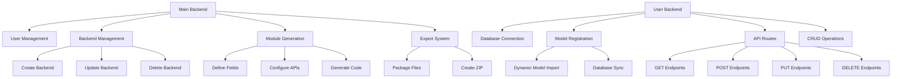
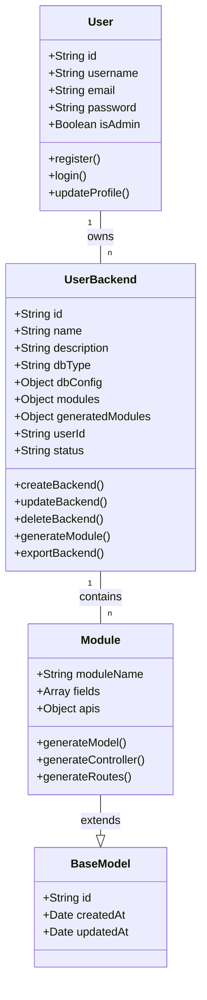
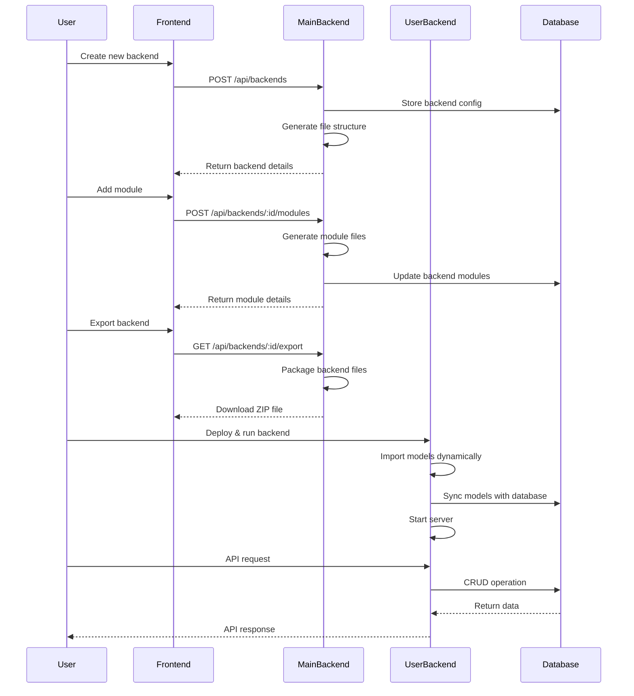

# Backend API Generator System

A powerful system for creating and managing custom backend APIs with automatic CRUD operations.

## 🚀 Overview

This project consists of two main components:

1. **Main Backend** - A management system that allows users to:
   - Create and manage multiple backend instances
   - Generate API modules with CRUD operations
   - Export backends as standalone applications

2. **User Backends** - Dynamically generated backend applications that:
   - Have their own database configurations
   - Support multiple API modules
   - Can be exported and run independently

## 🏗️ System Architecture



## 📊 Data Model



## 🔄 Workflow



## ✨ Features

### Main Backend
- **Backend Management**: Create, update, and delete backend instances
- **Module Generation**: Generate API modules with customizable fields and endpoints
- **Export System**: Export backends as standalone ZIP files
- **User Authentication**: Secure access to backend management

### User Backends
- **Dynamic Module Loading**: Automatically imports and registers all models
- **Database Synchronization**: Creates tables based on defined models
- **Cross-Platform Support**: Works on Windows, macOS, and Linux
- **RESTful API**: Standard CRUD operations for all modules

## 🛠️ Tech Stack

- **Backend**: Node.js, Express.js
- **Database**: MySQL/PostgreSQL (configurable)
- **ORM**: Sequelize
- **Authentication**: JWT
- **Frontend**: React, Redux, Vite

## 📋 Prerequisites

- Node.js (v14+)
- MySQL or PostgreSQL
- npm or yarn

## 🔧 Installation

### Clone the repository
```bash
git clone <repository-url>
cd back-0705
```

### Install dependencies for main backend
```bash
cd backend
npm install
```

### Install dependencies for frontend
```bash
cd ../frontend
npm install
```

## ⚙️ Configuration

### Main Backend
1. Create a `.env` file in the `backend` directory:
```
PORT=5000
DB_HOST=localhost
DB_USER=root
DB_PASSWORD=your_password
DB_NAME=api_generator
JWT_SECRET=your_jwt_secret
```

### Frontend
1. Create a `.env` file in the `frontend` directory:
```
VITE_API_URL=http://localhost:5000/api
```

## 🚀 Running the Application

### Start the main backend
```bash
cd backend
npm start
```

### Start the frontend
```bash
cd frontend
npm run dev
```

## 📝 Usage Guide

### Creating a New Backend
1. Log in to the frontend application
2. Navigate to "API Generator"
3. Click "Create New Backend"
4. Fill in the required details:
   - Name
   - Description
   - Database type
   - Database configuration

### Generating API Modules
1. Select a backend from the list
2. Click "Add Module"
3. Define the module:
   - Module name
   - Fields (name, type, constraints)
   - API endpoints to generate

### Exporting a Backend
1. Select a backend from the list
2. Click "Export"
3. Download the ZIP file

### Running an Exported Backend
1. Extract the ZIP file
2. Install dependencies:
   ```bash
   npm install
   ```
3. Configure the database in the `.env` file
4. Start the server:
   ```bash
   npm start
   ```

## 🔄 API Endpoints

### Main Backend
- `POST /api/auth/register` - Register a new user
- `POST /api/auth/login` - Login
- `GET /api/backends` - Get all backends
- `POST /api/backends` - Create a new backend
- `GET /api/backends/:id` - Get a backend by ID
- `PUT /api/backends/:id` - Update a backend
- `DELETE /api/backends/:id` - Delete a backend
- `POST /api/backends/:id/modules` - Generate a module for a backend
- `GET /api/backends/:id/export` - Export a backend

### User Backends
- `GET /api/:moduleName` - Get all records
- `GET /api/:moduleName/:id` - Get record by ID
- `POST /api/:moduleName` - Create a new record
- `PUT /api/:moduleName/:id` - Update a record
- `DELETE /api/:moduleName/:id` - Delete a record

## 🧪 Testing

### Main Backend
```bash
cd backend
npm test
```

### Frontend
```bash
cd frontend
npm test
```

## 🔒 Security

- JWT authentication for secure API access
- Password hashing for user security
- Environment variables for sensitive information

## 🤝 Contributing

1. Fork the repository
2. Create your feature branch (`git checkout -b feature/amazing-feature`)
3. Commit your changes (`git commit -m 'Add some amazing feature'`)
4. Push to the branch (`git push origin feature/amazing-feature`)
5. Open a Pull Request

## 📄 License

This project is licensed under the MIT License - see the LICENSE file for details.

## 📞 Contact

For support or inquiries, please contact [palakardeshna4@gmail.com]. 